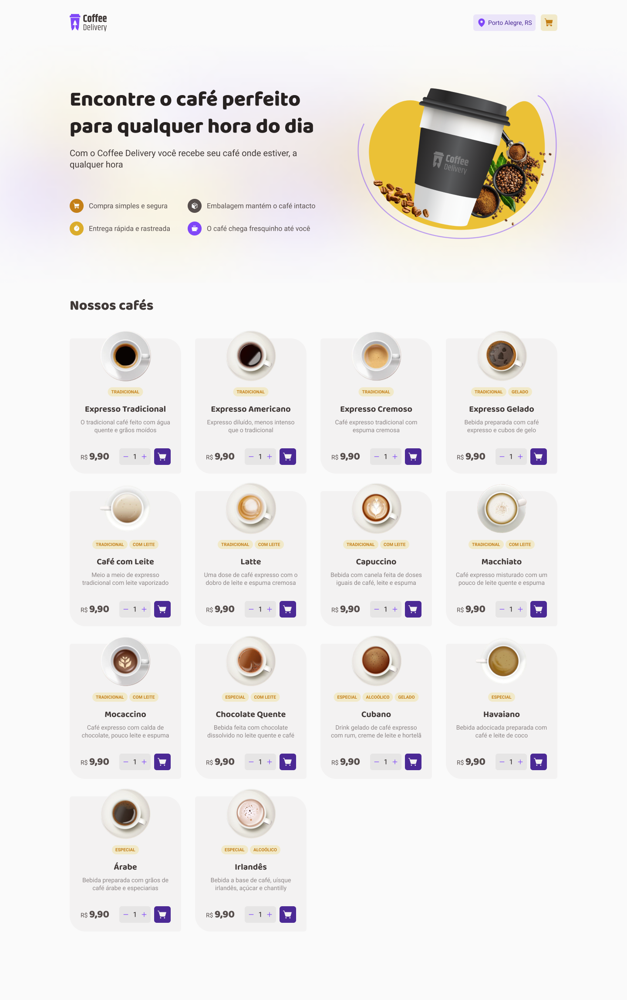

<h1 align="center">
  
</h1>

<br />

<h3 align="center">
  🎯 About Challenge 
</h3>

In this challenge, I developed an application to manage a shopping cart for a fictional coffee shop, which contains the following features:

- [x] List of products available for purchase
- [x] Add a specific number of items to the cart
- [x] Increase or decrease the number of items in the cart
- [x] Form for the user to fill in their address
- [x] Display total items in cart in Header
- [x] Display the total value of the sum of items in the cart multiplied by the value

I need to apply concepts like:

- State
- ContextAPI
- LocalStorage
- Imutability
- Lists and Kays in ReactJS
- Properties
- Componentization

<h3 align="center">
  💻 Technologies & Layout
</h3>

- [React](https://reactjs.org)
- [React-hook-form](https://react-hook-form.com/get-started)
- [React-router-dom](https://reactrouter.com/en/main)
- [Context API](https://pt-br.reactjs.org/docs/context.html)
- [TypeScript](https://www.typescriptlang.org/)
- [Styled Components](https://styled-components.com/)
- [zod](https://zod.dev/)
- [Phosphor-react](https://phosphoricons.com/)
- [polished](https://github.com/styled-components/polished)
- [vite](https://vitejs.dev/)

And that was the result achieved

<p align="center">
  
  
</p>

<br />


## :gear: | If you want testing

```bash
  ### install the dependencies
  $ npm i
  
  ### running aplication
  $ npm run dev
  
  ### you can see on port http://localhost:5173
```

I'm back with my carrer with this challenge, so I'll see you later, bye 👋🏻

Developed with ❤️ by [Vinicius de Souto](https://github.com/soutovnc)
